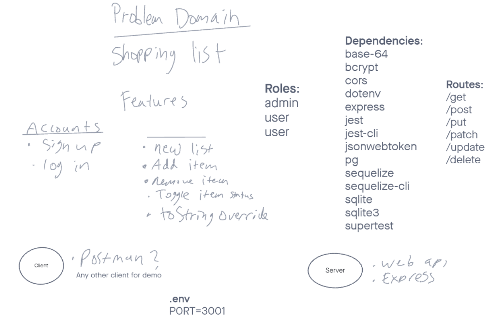

# Express Server

Created by Barrett Nance, Christopher Burk, Joe Ivans, Stefanie Riehle

## Installation

...

## Summary of Problem Domain

We are creating a basic server that will allow end users to:

-   sign up
-   log in
-   add items to a shopping list
-   remove items from a shopping list
-   toggle item status

## Links to application deployment

...

## Include embedded UML

## Talk about your routes

...

## Routes

-   HTTP POST

    -   Path: /
    -   accepts a string

-   HTTP GET
    -   Path: /
    -   responds with the last string used in post route /talk

### NOTES TO TEAM:

**DONE**

-   models (index, item, user)
-   index.js (main)
-   server.js

**NOT COMPLETED**

-   v1routes
-   v2routes
-   error handlers
-   middleware
-   tests
